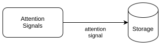

# Mindstream — Attention Flows

- Path: `ctx/docs/architecture/data-flow/attention.md`
- Template Version: `20260619`
- Changed: `20260726`

## Purpose

This document defines **Attention flows** in the Mindstream MVP.

Attention flows are the architecturally permitted write-only data flows that originate in the browser context and, under the required conditions, are transmitted to the server-side storage contour as statistical facts.

This document describes only Attention flows and does not cover **Content Collection flows** or local computational loops inside the browser contour.

Local score-based highlighting and feed hiding are one browser-only projection governed by the same interest cutoff: they consume derived local scoring information, send no threshold through this flow, and have no effect on attention transfer or collective statistics.

---

## Architectural Position

Attention flows connect the browser contour that captures attention with the server-side storage contour.

These flows:

- originate in the browser context;
- move from the browser to the server side of the system (`Browser → Storage`);
- are statistical in nature;
- do not participate in forming or changing the Content Collection.

---

## General Model Of Attention Flows

Attention signals record facts of interaction between the browser context and read representations of publications.

Signals are accumulated as statistical observations without interpretation of order, causality, or intent; sequencing and composition of attention forms belong to the application and UI levels.

Diagram: Attention flows.

The semantic interpretation of attention signals and their effect on the local interest vector are defined in `../attention/interest-vector.md`.

---

## Attention-Signal Transfer Flow

(`Browser → Storage`)

### Purpose

Transfer recorded attention signals from the browser contour to the server-side storage contour as statistical facts.

### Data Transferred

- publication identifiers;
- indicators of interaction with the publication;
- the minimum context required for later aggregation.

### Flow Properties

- the flow is one-way and write-only;
- transmitting signals does not change the Content Collection;
- signals do not trigger recalculation of semantic representations or embeddings;
- absence of transmission does not break system operation.

---

## Conditional Signal Transmission

Transmission of attention signals is **conditional** and depends on the presence of a **registered anonymous identity** in the browser context.

### Context Without Identity

- anonymous identity is absent or not registered;
- attention signals may be recorded and used only locally;
- no signals are transmitted to the server-side storage contour.

### Context With Registered Identity

- anonymous identity exists and is registered;
- attention signals may be transmitted to the server-side storage contour;
- transmitted signals are used only for statistical aggregation.

In all cases, the architectural role of attention signals remains unchanged.

The anonymous-identity model and its lifecycle are defined in `ctx/docs/architecture/anonymous-identity/invariants.md`.

---

## Constraints

Global prohibitions on reactivity, feedback loops, and control flows apply to Attention flows and exclude any influence of attention signals on Content Collection flows.

---

## Document Boundary

This document does not describe:

- user interface and interaction forms;
- product scenarios;
- interpretation of attention signals;
- aggregation and analysis algorithms;
- the structure of the interest vector;
- storage and transport formats;
- API endpoints and ingress implementations.

These questions belong to other documentation layers.

---

## Summary

This document defines Mindstream Attention flows as one-way write-only observation flows that transmit attention facts from the browser context to server storage **only when a registered anonymous identity exists**, without control effects, without reactivity, and without any influence on the Content Collection within the MVP.
