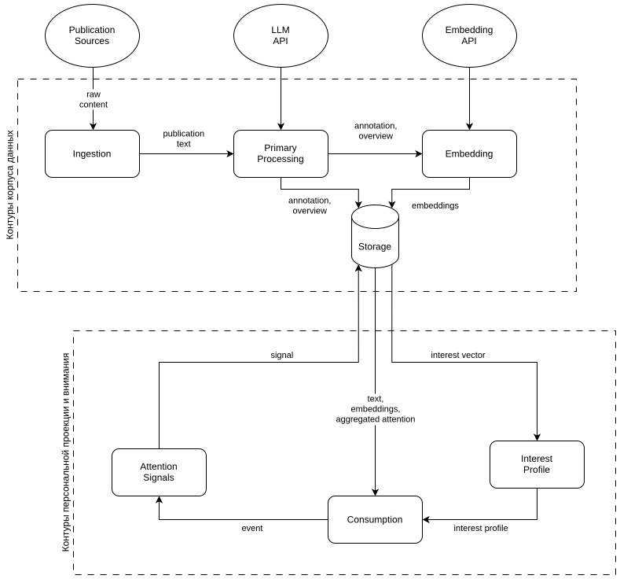

# Mindstream — Architecture Overview

- Path: `ctx/docs/architecture/overview.md`
- Template Version: `20260619`
- Changed: `20260727`

## Purpose

This document defines the architectural form of the Mindstream MVP: its architectural axes, contours, the boundary between the system and the external environment, and the base flow invariants, without moving into implementation, API, SQL, or user interface details.

The architecture is derived from product meaning and MVP constraints and does not introduce new product entities.

---

## Architectural Axes

- **Content Collection** — the technical set of publications and their derived representations shared by all reading contexts.
- **Attention** — statistical observation signals captured in the browser context as write facts.
- **Anonymous Identity** — the architectural write-path projection of a profile UUID as a technical identifier for the source of attention signals; not a subject and not an independent product user model.

---

## Architectural Contours

- **ingress** — the external boundaries that accept read/write requests.
- **data flow** — the permitted data flows between contours.
- **storage** — the canonical storage of the Content Collection and attention statistics.
- **runtime** — the execution boundary of server contours without implementation specifics.

---

## System Boundary And External Environment

The Mindstream system includes the server-side Content Collection contours, the attention-signal storage contour, and the browser-side contour that captures attention signals.

The external environment includes publication sources, LLM and embedding services, the network, and execution infrastructure.

### Ingress Boundaries

Interaction between the external environment and the system happens through architectural ingress boundaries:

- `ingress/http-ingress.md` — the HTTP boundary for read/write requests.
- `ingress/attention-write-ingress.md` — the write-only boundary for attention signals.

---

## Architectural Diagram

The diagram is explanatory and does not define implementation or technology choices.

---

## Data Flows And Directionality

- **Content Collection flows** run only inside server contours and form the sequence `ingestion → content processing → storage`.
- **Attention flows** move from the browser contour into storage and are write-only.
- Attention signals may be transmitted only when a registered anonymous identity exists.

---

## MVP Architectural Invariants

- The Content Collection is canonical state and does not depend on attention signals.
- Attention signals do not trigger recalculation of the Content Collection and do not create global feedback loops.
- Anonymous identity records the source of attention as a technical entity and is not used for personalization at the architectural level.

---

## Document Boundary

This overview does not describe publication sources, processing algorithms, storage and transport formats, API contracts, UI/UX, or runtime engineering decisions.

---

## Summary

The Mindstream MVP architecture is defined by three axes (Content Collection, Attention, Anonymous Identity), explicit ingress boundaries, and one-way data flows in which storage records the canonical Content Collection state and attention statistics without reactive feedback loops.
